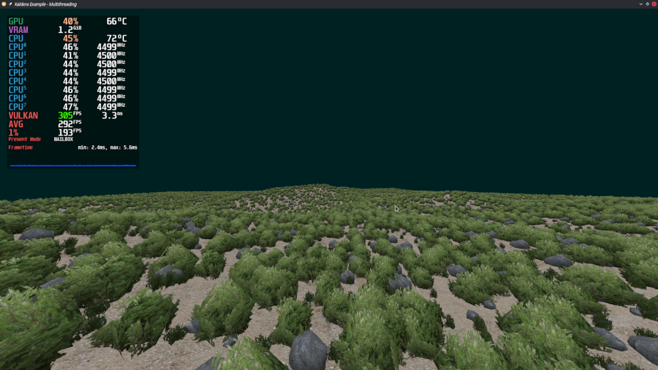
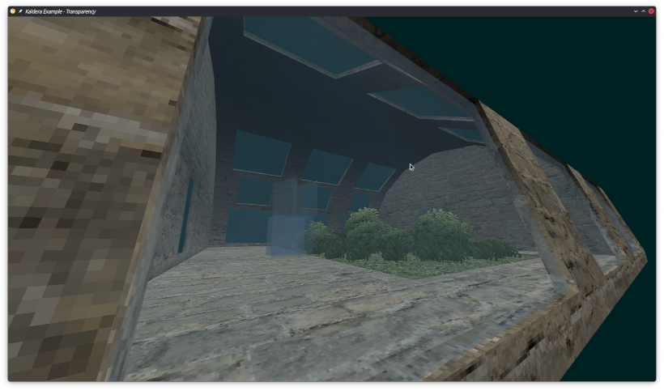
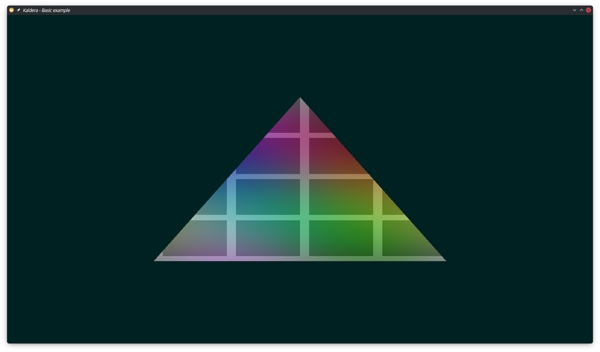

# Kaldera

*Vulkan, but a little more comfy :3*

This is an experiment. On the surface, it is a Vulkan 1.4-based library for C#, targeting .NET 8 (soon 10), MIT-licenced.

It focuses on **one** GAPI and fully embraces it. This is orthogonal to the likes of Veldrid, NVRHI, SDL3_gpu, BGFX...

It is also an **exploration**, in how Vulkan could be abstracted nicely, reduced to what *really* matters for desktop and PCVR. Less fluff and "API bureaucracy", more doing cool stuff. In this aspect, it is very much a GAPI in itself.

## I wanna know more!

Here is a code snippet to give you an idea:
```cs
commands.PushUniformBuffer( cameraBuffer, 0, 0 );
commands.PushSampler( sampler, 0, 1 );
commands.PushUniformBuffer( entityMatrixBuffer, 0, 2 );
commands.PushSampledTexture( texture, 0, 3 );

commands.BindVertexBuffer( vertexBuffer, 0 );
commands.BindIndexBuffer( indexBuffer );
commands.DrawIndexed( indexBuffer.Count, instanceCount: 1 );
```

You can read more in [DETAILS.md](DETAILS.md).

## Examples

Examples can be found here: [link](src/Examples/)


Multithreading example: 61k total instances of bushes, rocks and grass. Modes: singlethreaded, multithreaded, instanced. ([link](src/Examples/Basic/Example102_Multithreading/))


Transparency example: Opaque, alphatest, alphablend. ([link](src/Examples/Basic/Example101_Transparency/))


"Minimal" example. SDL3 window, instance, device and queue creation, a graphics pipeline and a nicely coloured triangle. ([link](src/Examples/ExampleMinimal/))

## Who's this for...?

Me and a few friends, obviously! I love C# and I love Vulkan, so I wanted to write a fanfic of the two.

If you're *new to graphics programming*, sure, I guess you could learn a thing or two from the examples - you can think of this as a "Vulkan with less boilerplate". This could also be your gateway to raw Vulkan.

If you're a *user of RHI libraries* (Veldrid, NVRHI, BGFX, SDL3_gpu...) and you only care about Vulkan (and want the features of 1.4!), then this might also be for you.

If you're *experienced in Vulkan* or whatever, then it's up to RNG. You probably have your own framework, and this ain't very interesting. Or maybe you're curious what's inside or you wanna leave feedback, possibly contribute. Feel free to look around or whatever. :)

If you're a *MacOS user* or you're *targeting mobile platforms*, hmmmph, I'm not sure about this one. I could direct you to SDL3_gpu.

My focus is Linux, Windows and PCVR on them. I may potentially look into Android stuff when I decide to do some mobile VR, but I really do not have any Apple hardware over here + you'd have to rely on a translation layer like MoltenVK or KosmicKrisp...

## Progress

This section will probably get moved to an issue soon(tm), but for now here's an overview.

TL;DR a lot of the core stuff is pretty much done. I'd like to get descriptor indexing & multiview done next, followed by OpenXR and Avalonia. Then it's just filling in the gaps, testing on different HW & SW...

Done:
* Kaldera:
	* Instance, device and queue creation
	* Device selection utility
	* Memory allocator interface and a simple, naive allocator impl.
	* Shader resources: buffers, textures, samplers, buffer slices...
	* Push descriptors
	* Primary, secondary, transient and long-life command buffers
	* Compute and graphics pipelines
	* Extended dynamic state 3
* Kaldera.Abstractions:
	* "Rich" buffer types: `VertexBuffer<T>`, `IndexBuffer`, `StagingBuffer`, `StorageBuffer`...
	* "Rich" texture types: `Texture`, `AttachmentColour`, `AttachmentDepthStencil`...
	* Render targets: `IRenderTarget`, `SwapchainRenderTarget`, `TextureRenderTarget`
	* Write-to-GPU utility: `UploadHelper`
	* Pipeline layout builder
	* "No Graphics API"-style simplified memory barriers
* A bunch of API examples:
	* Narrow API-focused examples (hello screen, hello triangle, buffers, textures, instanced rendering...)
	* Basic high-level examples (model loading, transparency, multithreaded drawcalls...)

Near future to-do:
* Test on Windows
* Test on AMD and Intel
* Nice readmes for examples etc.
* Asset copying for examples...
* Kaldera:
	* Multiview
	* Descriptor indexing
	* Debug names for buffers, textures etc.
	* Reduce name clashing with Silk.NET Vulkan bindings
	* Overall cleanup & fill in the gaps
* Kaldera.Abstractions:
	* Read-from-GPU utility: `DownloadHelper`
	* Stencil buffer for `TextureRenderTarget`
	* G-buffer render target
* Extension/addon system:
	* VMA addon
	* OpenXR addon
	* Avalonia addon
	* Move EDS3 to an addon

Far future to-do:
* Ray tracing and mesh shading?
* Multi-queue and multi-GPU??
* Video encoding stuff???
